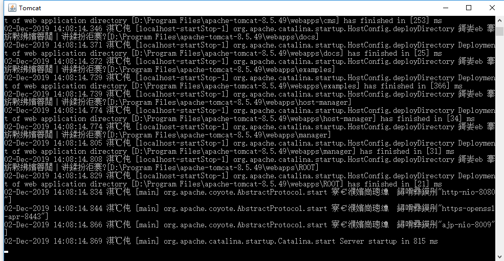

## 说明

本次 HTTP2.0 基于 Tomcat 进行测试，系统环境为windows，Linux系统可自行百度解决

## 1. 安装、配置 jdk

### 1.1 在官网中下载安装需要安装的版本

https://www.oracle.com/technetwork/java/javase/downloads/index.html

> tips: `Tomcat8.5 +` 需要 `java7 +`支持; `Tomcat9.0 +` 需要 `java8 +`支持

### 1.2 配置环境变量

可自行百度解决
安装检测：命令行输入： `java -version`，`enter` 查看版本号

## 2. 安装 OpenSSL、生成伪证书

### 2.1 安装包下载

windows 版本下载地址： http://slproweb.com/products/Win32OpenSSL.html，版本限制 `1.0.2 +`，将文件包解压缩到可以通常软件安装位置

### 2.2 生成证书

在 OpenSSL 安装包内 `shift + 右键` 打开命令行

```shell
// 生成一个RSA私钥
# openssl genrsa -des3 -out server.ori.key 2048
.... // 自行加密，密码会用于下面
// 生成免密码输入key
# openssl rsa -in server.ori.key -out server.key
// 创建证书签名请求CSR文件
# openssl req -new -key server.key -out server.csr
... // 填写一些信息，可随意填写，但请记住填写的内容
// 制作CA证书
# openssl x509 -req -days 365 -in server.csr -signkey server.key -out server.crt

// 所有操作完成后会生成四个文件： server.crt、server.csr、server.key、server.ori.key
```

## 3. 安装、配置 Tomcat

### 3.1 安装包下载

https://tomcat.apache.org/（请下载 `Tomcat8.5 +` ，8.5 以下不支持 `http2`），将文件包解压缩到可以通常软件安装位置

### 3.2 配置环境变量

可自行百度解决
安装检测：命令行输入：`startup.bat`，`enter` 即可运行 Tomcat，打开浏览器键入url：`http://localhost:8080/`，测试 Tomcat 是否运行成功

### 3.3 关于 Tomcat 命令行显示乱码问题



1. 打开 Tomcat 安装目录（文件包解压存放位置）


2. 打开 conf 文件夹，打开 `logging.properties`文件，`ctrl + f` 组合键快速查找 `java.util.logging.ConsoleHandler.encoding = UTF-8` ，更改 `UTF-8` 为 `GBK`，保存后关闭，重启 Tomcat 即可


### 3.4 配置 Tomcat 支持 HTTP2.0

- 打开配置文件夹 `conf` （不同版本可能名称不同，但认准为配置文件夹即可）

  

- 将第二步中生成的证书、秘钥等四个文件拷贝到配置文件夹 `conf` 内

- 编辑 `server.xml` ： 找到 被注释掉的 `http2` 板块，并将其放开，将证书文件名称替换为放置在配置文件夹内的文件名称

  ```
  <Connector port="8443" protocol="org.apache.coyote.http11.Http11AprProtocol"
             maxThreads="150" SSLEnabled="true" >
      <UpgradeProtocol className="org.apache.coyote.http2.Http2Protocol" />
      <SSLHostConfig>
          <!-- 更改证书文件名称 -->
          <Certificate certificateKeyFile="conf/server.key"
                       certificateFile="conf/server.crt"
                       type="RSA" />
      </SSLHostConfig>
  </Connector>
  ```

### 3.5 配置完成，测试

关闭之前测试时打开的 `Tomcat` ，命令行方式重新启动，在浏览器中，输入 `https://localhost:8443` ，在输出日志文件夹 `logs` 中 `localhost_access_log.` 即可查看本次 `http` 请求信息。


> tips: 此时，在本地服务器中 8080 端口依然为 http1.1 协议，只有 8443 端口支持 http2.0 协议；