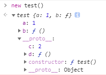
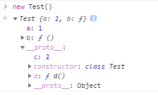

> 函数是 JavaScript 中的一等公民，类是 Java 中的提出的概念，在 es6 之后 JavaScript 也提供了类的定义。
>
> 这篇随笔将尝试讨论函数与类的异同点。

## 函数

看下面的一段代码

~~~javascript
// console.log(test) 函数声明会提前
function test () {
  this.a = 1;
  this.b = function () {
    console.log(this);
  }
}

test.prototype.c = 2;
test.prototype.d = function () {
  console.log(this);
}
~~~

构造函数中定义了两个属性 a，b，构造函数的 prototype 上定义了属性 c，d，接下来看看它的实例有哪些属性值

我们用类来实现以上内容

~~~javascript
// console.log(Test) // 编译报错，不存在变量提升问题
class Test {
	constructor() {
    this.a = 1;
    this.b = function () {
      console.log(this)
    }
  }
  d() {
    console.log(this);
  }
}
Test.prototype.c = 2;
~~~

在控制台查看类 Test 的实例

以上我们知道 类 和 函数 很相似，它也有 prototype 属性，在创建实例时，也是用 new 关键字。接下来，我们看看类具体有哪些内容。

## 类

### constructor

在该函数内部 this 指向类的实例，

### static

默认情况下，类中定义的函数都可以被类的实例调用，在方法前加上 static 关键字，则该方法不会被实例继承，普通变量亦如此

~~~javascript
class Test {
	static a = 2
  b = 3
  static c() {
    console.log('hello')
  }
  d () {
    console.log(this.a);
  }
}
// new Test().a // undifined
// new Test().c() // TypeError
console.log(Test.a) // 2
Test.c() // hello
~~~

### void

## 类的拓展

看看这段代码

~~~
class Test {
	a = 1
  b = function () {
    console.log(this);
  }
  d = () => {
  	console.log(this);
  }
}
~~~

与之前的代码段相比，我们通过 `key = value` 的形式在类上定义了三个属性。让我们看看控制台