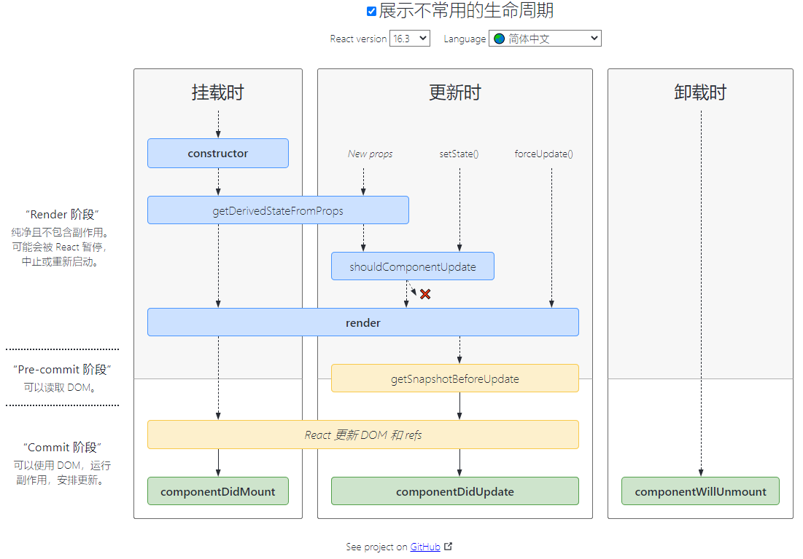

# 创建 React 应用

> tips：npx 是 npm5.2+ 附带的package运行工具，使用它可以不用全局安装而直接执行包。

~~~shell
npx create-react-app demo
cd demo
npm start
~~~

# 开始

react 官方文档：[https://react.docschina.org/](https://react.docschina.org/) 

## props & 组件

在官网中我们经常会看到这样的代码

~~~jsx
class Test extends Component {
  constructor(props) {
    super(props);
    // ...
  }
}
~~~

通常情况下我们不需要那样写，除非在 constructor 中需要使用 props 中的值做些其他操作。

### 函数式组件

组件注册

~~~jsx
function CompA () {}
~~~

### 类式组件

组件注册

~~~jsx
// ./CompA.js
import { Component } from "react";
class CompA extends Component {
  render() {
    return (
    	
hello

    )
  }
}
export default CompA;
~~~

组件使用

~~~jsx
// ./CompB.js
import CompA from "./ComA";
import { Component } from "react";
class CompB extends Component {
  render() {
    return (
    	

        hello, have B
      	<CompA />
      

    )
  }
}
export default CompA;
~~~

### 组件样式

## state

在组件中 state 是私有的，完全受控于当前组件。

### 定义状态

通过构造函数注册到实例上

~~~jsx
class Test extends Component {
  constructor() {
    this.state = {
      count: 0
    }
  }
}
~~~

直接定义在实例上，与 constructor 相比，它更简洁些

~~~jsx
class Test extends Component {
  state = {
    count: 0
  }
}
~~~

### 更新状态

组件的更新只能通过 setState 函数。

~~~jsx
constructor() {
  this.state = {
    count: 0
  }
}

render() {
  const { count } = this.state;
  return (
  	

    	count: {count}&nbsp;
      <button onClick={this.handleAdd}>count++</button>
    

  )
}

handleAdd = () => this.setState(state => ({ count: state.count + 1 }))
~~~

> setState 函数接收一个对象或者一个函数：[给 setState 传递一个对象与传递一个函数的区别是什么？](https://zh-hans.reactjs.org/docs/faq-state.html#what-is-the-difference-between-passing-an-object-or-a-function-in-setstate) 

## jsx

> 将 js 与 html 混合使用的语法糖

### 1. 字符串渲染

~~~jsx
render() {
	return 
hello

}
~~~

### 2. 变量渲染

~~~jsx
constructor() {
  this.state = {
    title: "hello"
  }
}

render() {
  const { title } = this.state;
	return 
{title}

}
~~~

### 3. 条件渲染

~~~jsx
constructor() {
  this.state = {
    show: false
  }
}

render() {
  const { show } = this.state;
  {/* 变量处理 */}
  let content;
  if (show) {
    content = do more;
  } else {
    content = <label>not have anymore</label>;
  }
	return (
    <ul>
      {/* 变量处理 */}
      <li>{content}</li>
      {/* 三元表达式 */}
  		<li>{show ? 'do more' : 'not have anymore'}</li>
      {/* && 连接符 */}
			{show && <li>do more</li>}
      <li><button onClick={this.handleShow}>switch show</button></li>
  	</ul>
  )
}

handleShow = () => this.setState(state => ({ show: !state.show }))
~~~

### 4. 列表渲染

> key 可以帮组 react 识别那些元素改变了，如果没有显式的指定 key 值，react 将默认使用索引作为 key 值。
>
> 兄弟节点之间 key 值必须是独一无二的。
>
> 当列表中项目的顺序可能发生变化时，使用索引作为 key 值，会导致性能变差，还可能引起组件状态的问题。
>
> 
——— 摘自 react 官方文档

~~~jsx
constructor() {
  this.state = {
    arrData: [
      {
        name: 'xiaopi',
        age: 18
      },
      {
        name: 'dapi',
        age: 36
      }
    ]
  }
  
  render() {
    const { arrData } = this.state;
    return (
    	<ul>
      	{arrData.map((item, i) => (
        	<li key={i}>
          	<label>name：{item.name}</label>&nbsp;
            age：{item.age}
          </li>
        ))}
      </ul>
    )
  }
}
~~~

## 生命周期

官方提供的生命周期图：[https://projects.wojtekmaj.pl/react-lifecycle-methods-diagram/](https://projects.wojtekmaj.pl/react-lifecycle-methods-diagram/) 

### 挂载

当组件实例被创建并插入 DOM 中时，其生命周期调用顺序如下：

- [**`constructor()`**](https://zh-hans.reactjs.org/docs/react-component.html#constructor) 
- [`static getDerivedStateFromProps()`](https://zh-hans.reactjs.org/docs/react-component.html#static-getderivedstatefromprops) 
- [**`render() `**](https://zh-hans.reactjs.org/docs/react-component.html#render) 
- [**`componentDidMount()`**](https://zh-hans.reactjs.org/docs/react-component.html#componentdidmount) 

### 更新

当组件的 props 或 state 发生变化时会触发更新。组件更新的生命周期调用顺序如下：

- [`static getDerivedStateFromProps()`](https://zh-hans.reactjs.org/docs/react-component.html#static-getderivedstatefromprops) 
- [`shouldComponentUpdate()`](https://zh-hans.reactjs.org/docs/react-component.html#shouldcomponentupdate) 
- [**`render()`**](https://zh-hans.reactjs.org/docs/react-component.html#render) 
- [`getSnapshotBeforeUpdate()`](https://zh-hans.reactjs.org/docs/react-component.html#getsnapshotbeforeupdate) 
- [**`componentDidUpdate()`**](https://zh-hans.reactjs.org/docs/react-component.html#componentdidupdate) 

### 卸载

当组件从 DOM 中移除时会调用如下方法：

- [**`componentWillUnmount()`**](https://zh-hans.reactjs.org/docs/react-component.html#componentwillunmount) 

