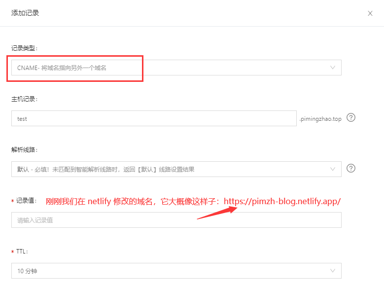

## 为什么选用 netlify

- netlify 可以免费提供 https 服务
- 可以跟 GitHub 联动，自动化构建、部署项目
- 它是免费的！而且还不慢！

## 开始部署

我们假设你已经完成以下工作

- 拥有一个 GitHub 账户（https://github.com/）
- 拥有一个 vue 项目，且已经上传到 GitHub
- 在阿里云（https://www.aliyun.com/）购买了一个域名（也可以是其它平台，这里以阿里云为例）
- 能够科学上网

OK，在科学上网环境下正式开始！

### 登录

1. 进入官方网址：https://app.netlify.com/

2. login -> 选择 GitHub 登录

3. 如果有错误信息提示，像下面这样

~~~
We’re having some trouble connecting you to Netlify.

This error may be caused by an ad blocker or browser extension. You can try disabling blocking on this page or running in incognito
~~~

4. 在无痕模式下访问即可

5. 登录成功后我们进入下一步

### 创建网站

点击 `New site from Git` -> 选择 GitHub -> 选择具体的项目 -> 配置一些选项

~~~
Branch to deploy // 选择以哪个分支作为部署分支
Build command // 构建时执行的命令，当我们推内容到部署分支时，就会触发这里的构建命令，进行自动化构建
Publish directory // 发布目录，一般是打包后的包名称
~~~

-> 点击 Deploy site 开始下一步域配置

### 域配置

1. 先修改下 netlify 默认的域名，它默认是一串 hash 值，我们修改为具有一定含义的英文名称例如：pimzh-blog

2. 打开阿里云，找到我们前面准备好的域名，点击 `解析` -> 添加一条解析记录

   

3. 回到 netlify，点击 `Add domain alias` 输入我们刚刚添加的主机记录 `test.***.***` ，点击保存后，它将开始验证 DNS 解析，如果解析过程中出现问题，要首先检查刚刚的添加的记录值是否有误，如果它提示

   ~~~
   dns1.p07.nsone.net
   
   dns2.p07.nsone.net
   
   dns3.p07.nsone.net
   
   dns4.p07.nsone.net
   ~~~

   ，那么把上面列出的域名在我们的阿里云里面逐条添加记录，就可以了

### 完成

以上便是部署的所有内容了，可能有点麻烦，但是并不难，对吧 :stuck_out_tongue_winking_eye: