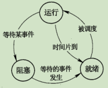

# 4 操作系统知识

## 4.1 操作系统概述

### 4.1.1 基本概念

#### 1 定义与作用

定义：能有效地组织和管理系统中的各种软件/硬件环境，合理地组织计算机系统工作流程，控制程序的执行，并且向用户提供良好的工作环境与接口

作用：

- 通过资源管理提高计算机的效率
- 改善人机界面向用户提供友好的工作环境

#### 2 特征与功能

4 大特征：并发性、共享性、虚拟性和不确定性

5 大部分：处理机管理（又称进程管理）、文件管理、存储管理、设备管理、作业管理

### 4.1.2 操作系统分类及特点

#### 1 批处理系统

又分单道批处理（一次只有一个作业进入内存执行）与多道批处理（宏观上并行，微观上串行）

#### 2 分时操作系统

特点：多路性、独立性、交互性和及时性

#### 3 实时操作系统

实时系统分为实时控制（用于生产过程中的自动控制）与实时信息处理（用于实时信息处理）

与分时区别：

- 系统设计目标不同：分时为多用户通用系统，交互能力强；实时大多为专用系统
- 交互性强弱不同：分时强实时差
- 响应时间的敏感程度不同：分时以用户接受的等待时间为依据，实时以被测物体所能接受的延迟时间为依据。实时敏感度更强

#### 4 网络操作系统

一个典型的网络系统的特征包括硬件独立性、多用户支持等

网络系统的分类：

- 集中模式
- 客户端/服务器模式
- 对等（Peer-to-Peer）模式

#### 5 分布式操作系统柜

由多个分散的计算机连接而成，无主、次之分，任意两台可交换信息

是网络操作系统的更高级形式，它持有网络系统的所有功能，同时有透明性、可靠性、高性能等特性

#### 6 微型操作系统

常用如Windows、Mac OS、Linux。

#### 7 嵌入式操作系统

特点：微型化、可定制、实时性、可靠性、易移植性

## 4.2 进程管理（也称处理机管理）

### 4.2.1 基本概念

#### 1.程序与进程

程序顺序执行的特征：顺序性、封闭性和可再现性

程序并行执行的特征：失去了封闭性、程序和机器的执行程序不再一一对应、并发程序间的相互制约性

#### 2 进程的组成

进程时程序的一次执行，由程序、数据和进程控制块（PCB，为进程存在的唯一标志）组成

#### 3 进程的状态及其切换

3 态模型：运行、就绪、阻塞

5 态模型：新建、就绪、运行、终止、阻塞

### 4.2.2 进程的控制

由操作系统内核中的原语（由若干机器指令组成）实现

### 4.2.3 进程间的通信

指进程间交换信息的过程

#### 1 同步与互斥

同步是合作进程间的直接制约问题、互斥是申请临界资源进程间的间接制约问题

临界区管理机制：

- 有空则进
- 无空则等
- 有限等待
- 让权等待

#### 2 信号量机制

是一种有效的进程同步与互斥工具

- 整形信号量与P（申请一个资源 s-=1）V（释放一个资源 s+=1）操作
- 公用信号量
- 私用信号量

#### 3 高级通信原语

PV 操作属于低级通信方式，其存在以下问题：

- 编程难度大
- 效率低

高级通信分为共享传递模式、消息传递模式、管道通信

### 4.2.4管理

#### 1管程

### 4.2.5进程调度

#### 1 三级调度

在某些操作系统中分为：一个作业从提交到完成需经历 高、中、低三级调度

#### 2 调度算法

#### 3 进程优先级确认

I/O完成时提高优先级；时间片用完时降低优先级

### 4.2.6 死锁

指两个以上进程相互要求对方已经占有的资源导致无法继续运行的现象

#### 1 死锁举例

#### 2 死锁的原因及 4 个必要条件

原因：竞争资源及进程推进顺序非法

4 个条件：互斥、请求保持、不可剥夺、环路

#### 3 死锁的处理

鸵鸟策略、预防策略、检测与解除死锁

P200页：死锁避免案例

### 4.2.7 线程

进程作为调度和分配的基本单位；线程作为独立分配资源的单位

线程基本不拥有资源，可与同属于一个进程的其他线程共享进程的全部资源

线程也具有就绪、运行和阻塞 3 种基本状态，线程可创建线程

## 4.3 存储管理

存储器管理主要功能：主存空间的分配与回收、提高主存的利用率、扩充主存、对主存信息实现有效保护

#### 1 存储器结构

常用有两种：寄存器-主存-外存、寄存器-缓存（Cache）-主存-外存

#### 2 地址重定位

指将逻辑地址转换成主存物理地址的过程

### 4.3.2 存储方案管理

旨在解决多个用户使用主存的问题

#### 1 分区存储管理