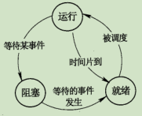
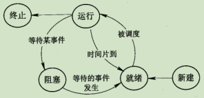
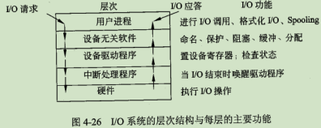
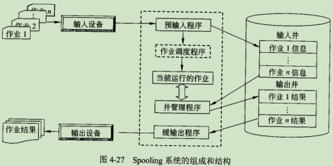

# 4 操作系统知识

## 4.1 操作系统概述

### 4.1.1 基本概念

#### 1 定义与作用

定义：能有效地组织和管理系统中的各种软件/硬件环境，合理地组织计算机系统工作流程，控制程序的执行，并且向用户提供良好的工作环境与接口

作用：

- 通过资源管理提高计算机的效率
- 改善人机界面向用户提供友好的工作环境

#### 2 特征与功能

4 大特征：并发性、共享性、虚拟性和不确定性

5 大部分：处理机管理（又称进程管理）、文件管理、存储管理、设备管理、作业管理

### 4.1.2 操作系统分类及特点

#### 1 批处理系统

又分单道批处理（一次只有一个作业进入内存执行）与多道批处理（宏观上并行，微观上串行）

#### 2 分时操作系统

特点：多路性、独立性、交互性和及时性

#### 3 实时操作系统

实时系统分为实时控制（用于生产过程中的自动控制）与实时信息处理（用于实时信息处理）

与分时区别：

- 系统设计目标不同：分时为多用户通用系统，交互能力强；实时大多为专用系统
- 交互性强弱不同：分时强实时差
- 响应时间的敏感程度不同：分时以用户接受的等待时间为依据，实时以被测物体所能接受的延迟时间为依据。实时敏感度更强

#### 4 网络操作系统

一个典型的网络系统的特征包括硬件独立性、多用户支持等

网络系统的分类：

- 集中模式
- 客户端/服务器模式
- 对等（Peer-to-Peer）模式

#### 5 分布式操作系统柜

由多个分散的计算机连接而成，无主、次之分，任意两台可交换信息

是网络操作系统的更高级形式，它持有网络系统的所有功能，同时有透明性、可靠性、高性能等特性

#### 6 微型操作系统

常用如Windows、Mac OS、Linux。

#### 7 嵌入式操作系统

特点：微型化、可定制、实时性、可靠性、易移植性

## 4.2 进程管理（也称处理机管理）

### 4.2.1 基本概念

#### 1.程序与进程

程序顺序执行的特征：顺序性、封闭性和可再现性

程序并行执行的特征：失去了封闭性、程序和机器的执行程序不再一一对应、并发程序间的相互制约性

#### 2 进程的组成

进程时程序的一次执行，由程序、数据和进程控制块（PCB，为进程存在的唯一标志）组成

#### 3 进程的状态及其切换

3 态模型：运行、就绪、阻塞

5 态模型：新建、就绪、运行、终止、阻塞

### 4.2.2 进程的控制

由操作系统内核中的原语（由若干机器指令组成）实现

### 4.2.3 进程间的通信

指进程间交换信息的过程

#### 1 同步与互斥

同步是合作进程间的直接制约问题、互斥是申请临界资源进程间的间接制约问题

临界区管理机制：

- 有空则进
- 无空则等
- 有限等待
- 让权等待

#### 2 信号量机制

是一种有效的进程同步与互斥工具

- 整形信号量与P（申请一个资源 s-=1）V（释放一个资源 s+=1）操作
- 公用信号量
- 私用信号量

#### 3 高级通信原语

PV 操作属于低级通信方式，其存在以下问题：

- 编程难度大
- 效率低

高级通信分为共享传递模式、消息传递模式、管道通信

### 4.2.4管理

#### 1管程

### 4.2.5进程调度

#### 1 三级调度

在某些操作系统中分为：一个作业从提交到完成需经历 高、中、低三级调度

#### 2 调度算法

#### 3 进程优先级确认

I/O完成时提高优先级；时间片用完时降低优先级

### 4.2.6 死锁

指两个以上进程相互要求对方已经占有的资源导致无法继续运行的现象

#### 1 死锁举例

#### 2 死锁的原因及 4 个必要条件

原因：竞争资源及进程推进顺序非法

4 个条件：互斥、请求保持、不可剥夺、环路

#### 3 死锁的处理

鸵鸟策略、预防策略、检测与解除死锁

P200页：死锁避免案例

### 4.2.7 线程

进程作为调度和分配的基本单位；线程作为独立分配资源的单位

线程基本不拥有资源，可与同属于一个进程的其他线程共享进程的全部资源

线程也具有就绪、运行和阻塞 3 种基本状态，线程可创建线程

## 4.3 存储管理

存储器管理主要功能：主存空间的分配与回收、提高主存的利用率、扩充主存、对主存信息实现有效保护

#### 1 存储器结构

常用有两种：寄存器-主存-外存、寄存器-缓存（Cache）-主存-外存

#### 2 地址重定位

指将逻辑地址转换成主存物理地址的过程

### 4.3.2 存储方案管理

旨在解决多个用户使用主存的问题

#### 1 分区存储管理

早期的管理方案，基本思想为将主存分区，每个区域分配给一个用户

#### 2 分区保护

防止未经允许的用户访问分区

### 4.3.3 分页存储管理

#### 1 纯分页存储管理

原理：将进程地址空间划分成若干大小相同的区域（页），将主存划分成与页相同大小的物理块（称块或页框）

地址结构：页号p + 页内地址w

页表：实现从页号到物理块号的地址映射

#### 2 快表

为了提高访问主存的速度，在地址映射机构中添加的小容量联想存储器

查找联想存储器与查找主页表是并行进行的，在前者查找到后就停止查找后者

#### 3 两级页表机制

### 4.3.4 分段存储管理

地址结构：段号s + 段内地址d

逻辑地址由段号（名）和段内地址两部分组成（例如：逻辑地址（0, 168））

逻辑地址转物理地址：当段内地址小于段表长度（段长）时： 物理地址 = 基地址 + 段内地址，否则地址越界，不能进行转换

### 4.3.5 段页式存储管理

地址结构：段号s + 段内页号p + 页内地址w

逻辑地址转物理地址：

1. 根据段号s查段表，得页表的起始地址
2. 根据页号p查页表，得物理块号b
3. 将物理块号b拼页内地址w得物理地址

### 4.3.6 虚拟存储管理

#### 1 程序局部性

表现在时间局限性和空间局限性两个方面

#### 2 虚拟存储器的实现

请求分页系统、请求分段系统、请求段页式系统

#### 3 请求分页管理的实现

在请求分页系统中，每当访问的页面不存在主存时便产生一个缺页中断

#### 4 页面置换法

- 最佳置换法：在最长时间内不再访问的页面将被置换（案例：p213）
- 先进先出（FIFO）置换算法：总是淘汰最先进入主存的页面（队列的思想，案例：p214）
- 最近最少使用（LRU）置换算法
- 最近未用（NUR）置换算法

#### 5 工作集

指某段时间间隔里进程实际要访问的页面的集合

## 4.4 设备管理

### 4.4.1 设备管理概述

在计算机系统中 I/O 系统由设备、控制器、通道、总线和 I/O 软件组成

#### 1 设备的分类

按数据组织分类、按设备的功能分类、从资源分配角度分类、按数据传输率分类

#### 2 设备管理的目标与任务

### 4.4.2 I/O 软件

I/O 软件一般分四层：中断处理程序、设备驱动程序、与设备无关的系统软件和用户级软件

### 4.4.3 设备管理采用的相关技术

#### 1 通道技术

#### 2 DMA 技术

直接主存存取（DMA）指数据在主存与 I/O 设备间直接成块传送，而不需要CPU的干涉

#### 3 缓冲技术

优点：

- 缓和CPU与I/O设备间速度不匹配的矛盾
- 减少对CPU的中断频率，放宽对中断响应时间的限制
- 提高CPU和I/O设备间的并行性

#### 4 Spooling 技术

外围设备联机操作的简称

spooling 系统案例：p220

### 4.4.4 磁盘调度

#### 1 磁盘驱动调度

调度算法：

- 先来先服务
- 最短寻道时间优先
- 扫描算法
- 单项扫描调度算法

### 2 旋转调度算法

案例：p222

## 4.5文件管理

### 4.5.1 文件与文件系统

#### 1 文件

#### 2 文件系统

#### 3 文件类型

目前常见的文件系统类型：FAT、Vfat、NTFS、Ext2、HPFS

### 4.5.2 文件的结构

#### 1 文件的逻辑结构

#### 2 文件的物理结构

文件在物理存储设备上的存放方法

### 4.5.3 文件目录

#### 1 文件控制块

#### 2 目录结构

全文件名：从盘符开始的路径名

相对路径：从当前工作目录下的路径名

### 4.5.4 文件存储

#### 1 文件的存取方法

通常有顺序存取和随机存取两种方法

#### 2 文件存储空间的管理

空闲区表、位示图、空闲块链、成组链接法

案例：p230