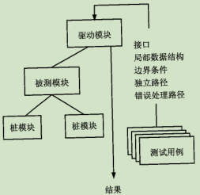

# 5 软件工程基础知识

## 5.1 软件工程概述

### 5.1.1计算机软件

#### 1 系统软件

特点：和计算机硬件大量交互；多用户大量使用。。。

#### 2 应用软件

指解决特定业务需要的独立应用程序

#### 3 工程/科学软件

常有‘数值计算’算法的特征

#### 4 嵌入式软件

例如：汽车中的燃油控制、仪表板显示、啥车系统等

#### 5 产品线软件

#### 6 Web应用

#### 7 人工智能软件

#### 8 开放计算

#### 9 网络资源

#### 10 开源软件

### 5.1.2 软件工程基本原理

#### 1 用分阶段的生命周期计算严格管理

#### 2 坚持进行阶段评审

#### 3 实现严格的产品控制

#### 4 采用现代程序和技术

#### 5 结果应能清楚的审查

#### 6 开发小组的人员应少而精

#### 7 承认不断改进软件工程实践的必要性

### 5.3.2 软件的生命周期

#### 1 可行性分析与项目开发计划

参与者：用户、项目负责人和系统分析师

#### 2 需求分析

参与者：用户、项目负责人和系统分析师

#### 3 概要设计

参与者：系统分析师与软件设计师

#### 4 详细设计

软件设计师与程序员

#### 5 编码

#### 6 测试

参与者：软件设计师或系统分析师

#### 7 维护

### 5.1.4 软件过程

#### 1 能力成熟度模型（CMM）

## 5.2 软件过程模型

也称软件开发模型

> 成本低

缺点：用户必须完整、正确和清晰地表达他们的需求

### 5.2.2 增量模型

瀑布模型的变体（进阶版 ）

它假设可以将需求分段为一系列增量产品，每一增量可以分别开发。第一增量为核心产品，用户对每个增量的使用和评估都将作为下一个增量发布的新特征和功能

优点：第一个可交付版本成本低、用时少；小系统风险不大

缺点：如果没有对用户的变更要求进行规划，那么产生的初始增量将不稳定，后续的增量可能会重新开发

### 5.2.3 演化模型

是迭代的过程模型

#### 1 原型模型

此方法适合于用户需求不清、需求经常变化，当系统规模不大也不复杂时使用

#### 2 螺旋模型

此模型特别适合于庞大、复杂并且具有高风险的系统

### 5.2.4 喷泉模型

是一种以用户需求为动力，以对象作为驱动的模型，适合于面向对象的开发

### 5.2.5 基于构件的开发模型

### 5.2.6 形式化方法模型

### 5.2.7 统一过程（UP）模型

用例和风险驱动，以架构为中心，迭代并且增量

### 5.2.8 敏捷开发

尽可能早地，持续地对有价值的软件的交付

#### 1 极限编程（XP）

#### 2 水晶法

#### 3 并列争求法

#### 4 自适应软件开发

#### 5 敏捷统一开发（AUP）

大型上连续、小型上迭代

## 5.3 需求分析

### 5.3.1 软件需求

功能、性能、用户或人、环境、界面、文档、数据、资源使用、安全保密、可靠性、软件成本、其他非功能性要求

### 5.3.2 需求分析原则

### 5.3.3 需求工程

#### 1 需求获取

#### 2 需求分析与协商

#### 3 系统建模

#### 4 需求规约

#### 5 需求验证

#### 6 需求管理

## 5.4 系统设计

面向数据流的结构化设计方法（SD）、面向对象的分析方法（OOD）

### 5.4.1 概要设计

1. 软件系统总体结构设计
2. 数据结构及数据库设计
3. 编写概要设计文档
4. 评审

### 5.4.2 详细设计

## 5.5 系统测试

### 5.5.1 系统测试与调试

#### 1 系统测试的意义、目的及原则

是保证系统质量和可靠性的关键步骤

#### 2 测试过程

指定测试计划、编制测试大纲、设计和生成测试用例、实施测试、生成测试报告

### 5.5.2 传统软件的测试策略

#### 1 单元测试

也称模块测试，

#### 2 集成测试

将模块按照系统设计说明书组合起来进行测试

#### 3 确认测试

集中于用户可见的动作和用户可识别的系统输出

#### 4 系统测试

将软件、硬件。外设和网络等其他因素结合。进行系统的各种集成测试和确认测试

### 5.5.3 测试面向对象软件

#### 1 单元测试

将封装的类作为测试的重点，类中包含的操作是最小的可测试单元

#### 2 集成测试

无明显层次结构控制，有两种策略：基于线程测试、基于使用测试

### 5.5.4 测试 Web 应用

#### 1 质量维度

内容。功能、结构。可用性、导航型、性能、兼容性、安全性

#### 2 WebApp 测试策略

### 5.5.5 测试方法

静态测试：人工检测、计算机辅助静态分析

动态测试：黑、白盒测试法

#### 1  黑盒测试

又称功能测试，不考虑软件内部结构与特性，测试软件的外部特性

等价类划分、边界值分析、错误推测

####  2 白盒测试

也称结构测试，根据内部和逻辑设计测试用例

### 5.5.6 调试

有程序开发人员进行

#### 1 调试过程

#### 2 调试方法

试探法、回溯法、对分查找法、归纳法、演绎法

## 5.6 运行和维护知识

### 5.6.1 系统转换

- 直接转换：立刻启用新系统，终止旧系统
- 并行转换：新、旧系统并行工作，一段时间后替换
- 分段转换：也称逐步转换。向导转换、试点过渡法

### 5.6.2 系统可维护概述

#### 1 系统可维护性概念

- 评价指标：可测试、可修改
- 维护与软件文档
- 软件的文档的修改

#### 2 系统维护的内容及类型

内容：硬件维护、软件维护、数据维护

#### 3 系统维护的管理和步骤

1. 提出维护、修改需求
2. 领导审查并答复
3. 领导分配任务
4. 验收维护成果并登记修改信息

### 5.6.3 系统评价

#### 1 系统评价概述

按评价时间与所处阶段从广义上分成：立项评价、中期评价、结项评价

#### 2 系统评价的指标

## 5.7 软件项目管理

### 5.7.1 软件项目管理涉及的范围

#### 1 人员

项目管理人员、高级管理人员、开发人员、客户。最终用户

#### 2 产品

项目环境、信息目标、功能和性能

#### 3 过程

#### 4 项目

明确目标及过程、保持动力、跟踪进展、明智的决策、事后分析

### 5.7.2 软件项目估算

#### 1 成本估算方法

- 自顶向下
- 自底向上
- 差别估算
- 其他估算
  - 专家估算、类推估算、算式估算

#### 2 COCOMO 估算模型

是一种精确地、易于使用的成本估算模型

#### 3 COCOMOII 估算模型

更全面的层次结构估算模型

- 应用组装模型
- 早期设计阶段模型
- 体系结构阶段模型

#### 4 Putnam 估算模型

是一种动态变量模型

### 5.7.3 进度管理

#### 1 进度管理基本原则

划分、相互依赖性、时间分配、工作量确认、确定责任、明确输出结果

#### 2 进度安排

- Gantt 图：以日历为基准描述项目任务
- PERT 图：有向图，可以标识任务间的关系

### 5.7.4 软件项目的组织

尽早落实责任、减少交流接口、责任均衡

#### 1 组织结构的模式

#### 2 程序设计小组的组织方式

### 5.7.5 软件配置管理

目的：标识变更、控制变更

#### 1 基线

是软件生存周期中各开发阶段的一个特定点

#### 2 软件配置项

配置管理的基本单位

#### 3 版本控制

#### 4 变更控制

是最重要的软件配置任务

配置数据库：1.开发库 2.受控库 3.产品库

### 5.7.6 风险管理

软件风险的特性：不确定性和损失性

#### 1 风险识别

风险条目检查表

#### 2 风险预测

又称风险估计

风险显露度 RE = P * C （P：风险发生概率，C：风险带来的项目成本）

#### 3 风险评估

#### 4 风险控制

风险避免/风险监控/RMMM计划

## 5.8 软件质量

### 5.8.1 软件质量特性

- ISO/IEC 9126软件质量模型：质量特性、质量子特性、度量指标
- Mc Call软件质量模型：质量特性、评价标准、度量指标

### 5.8.2 软件质量保证

### 5.8.3 软件评审

设计质量评审、程序质量评审

### 5.8.4 软件容错技术

### 5.8.5 软件度量

#### 1 面向规模的度量

#### 2 面向功能的度量
